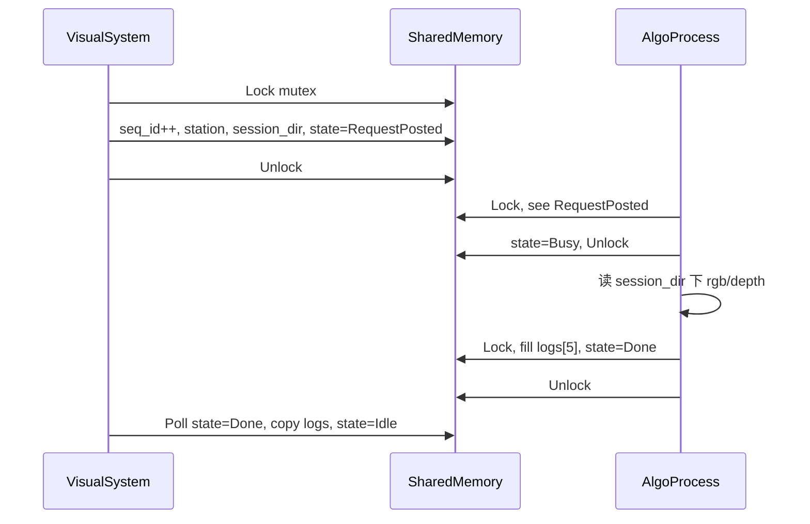

# 算法共享内存协议（algo_shm_protocol）

视觉主进程（VisualSystem）与独立算法进程之间的 IPC 契约。头文件：`libs/adapter_algo_shm/include/visual/algo_shm_layout.h`。

MVP 实现为 **Win32 命名 FileMapping + Mutex**；算法侧参考 `tools/mock_algo_service/main.cpp`。

## 命名对象（双工位 v3）

| 通道 | SHM 映射名 | Mutex | 说明 |
|------|-----------|-------|------|
| R05（含 R07） | `Local\\VisualSystemAlgo_R05_v3` | `Local\\VisualSystemAlgoMutex_R05_v3` | 默认值，可由 `setting.json` → `algo.channels.r05` 覆盖 |
| R09 | `Local\\VisualSystemAlgo_R09_v3` | `Local\\VisualSystemAlgoMutex_R09_v3` | 同上 `algo.channels.r09` |

遗留单通道 `Local\\VisualSystemAlgo_v2` 仅作兼容字段，运行时不再使用。

Header 布局 version 仍为 **2**（字段未变）；通道命名独立为 v3。

## 布局（version = 2）

每工位各一块完整映射，布局相同：

```c++
#pragma pack(push, 1)

struct ShmLogResult {
  int32_t  status;
  double   offset_x_mm, offset_y_mm, offset_r_deg;
  double   diameter_mm, length_mm;
};

struct ShmHeader {
  uint32_t magic;        // 0x56414C47 ('VALG')
  uint32_t version;      // 2
  uint32_t seq_id;
  State    state;
  int32_t  station_id;   // 5=R05, 7=R07, 9=R09
  int32_t  camera_count;
  uint32_t input_mode;
  uint32_t transfer_flags;
  char     session_dir[512];
  char     error_message[256];
  ShmLogResult logs[5];
  // + cameras[] 元数据，后接 blob arena
};

#pragma pack(pop)
```

总大小：`kShmTotalSize = sizeof(ShmHeader) + kBlobArenaSize`（每通道各一份）。

## 状态机

```
Idle → RequestPosted → Busy → Done | Error → Idle
```

| State | 值 | 写入方 | 含义 |
|-------|-----|--------|------|
| kIdle | 0 | 双方 | 空闲 |
| kRequestPosted | 1 | 视觉 | 请求已发布，算法可读取 |
| kBusy | 2 | 算法 | 算法处理中 |
| kDone | 3 | 算法 | 结果已写入 logs[] |
| kError | 4 | 算法 | error_message 有效 |

## 交互流程



### 视觉侧（ShmAlgoService）

1. `Start()` 创建或打开映射，初始化 magic/version。
2. `Run(AlgoRequest)`：
   - 持锁写入 `seq_id`、`station_id`、`camera_count`、`session_dir`。
   - `state = kRequestPosted`，释放锁。
   - 轮询直至 `kDone` / `kError` 或超时（`algo.timeoutMs`，默认 30000）。
3. 成功时将 `logs[5]` 转为 `LogResultBatch`；完成后置 `kIdle`。

### 算法侧

1. 打开同名映射与 Mutex（可先启动，也可后启动）。
2. 循环等待 `kRequestPosted`。
3. 置 `kBusy`，从 `session_dir` 读取采集文件（命名约定：`cam1_rgb.png`、`cam1_depth.tif` 等）。
4. 写入 5 条 `ShmLogResult`（Status 与 AB PLC 一致：1=OK, 2=NG）。
5. `state = kDone` 或失败时 `kError` + `error_message`。

## Status 枚举（与 PLC 对齐）

| 值 | 含义 |
|----|------|
| 0 | Default |
| 1 | OK |
| 2 | NG |
| 3 | NotLog |

## 配置

```json
"algo": {
  "shmName": "Local\\VisualSystemAlgo_v1",
  "timeoutMs": 30000,
  "useShm": false
}
```

- `useShm: false`：进程内 `MockAlgoService`，无需独立算法进程。
- `useShm: true`：先运行 `mock_algo_service.exe`，再启动 VisualSystem。

## 扩展（后续版本）

当前 v1 仅传递 **session_dir** 路径，不传像素 blob。后续可增加：

| 区域 | 内容 |
|------|------|
| Input blob | 每相机 meta（serial、WxH、depth scale）+ 像素/点云偏移 |
| Output 扩展 | 2D/3D 结果图路径、置信度 |
| camera_count | 多相机时 SHM Input 扩展 |

升级时需递增 `kVersion` 并保持向后兼容或双映射名。

## Mock 算法进程

```bat
build\tools\mock_algo_service\Release\mock_algo_service.exe
```

行为：收到 `kRequestPosted` 后延迟 50ms，填充 5 条 OK Log（X=0.1*i，Diameter=100，Length=900），置 `kDone`。

## 与 SequenceEngine 的关系

`SequenceEngine::RunCycle` 在采集完成后调用 `IAlgoService::Run`；结果 batch 经 `VisionPlcAdapter::WriteLogResults` 写入 PLC，并经 `EventBus::CycleCompleted` 刷新 UI。
