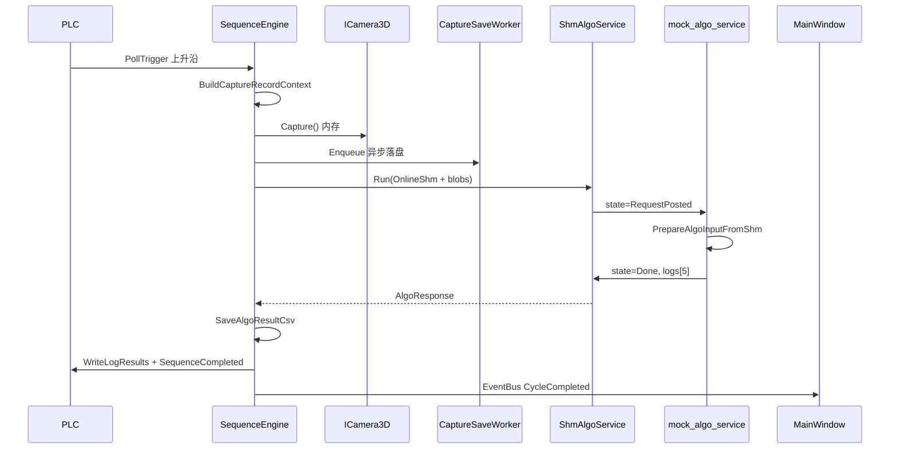
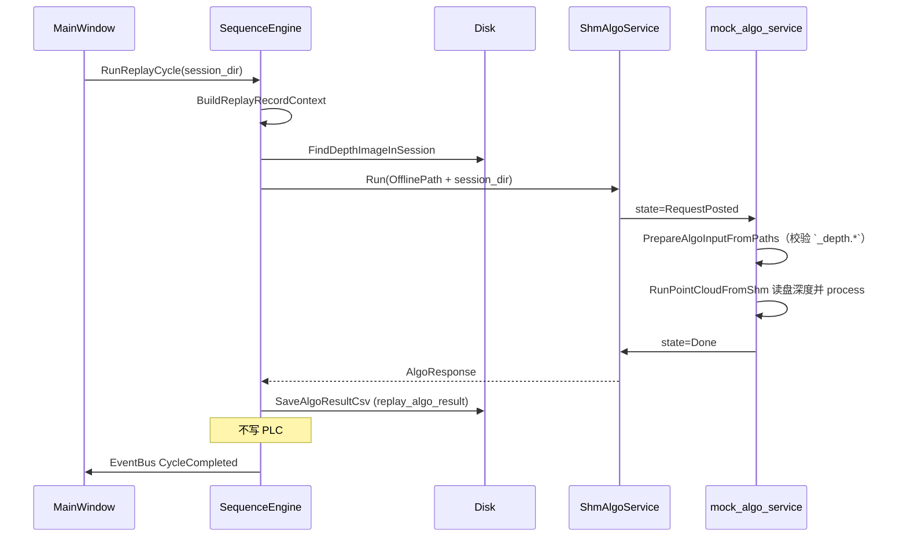

# Visual System 框架流程通路

> 代码内分阶段注释与本文档章节对应（搜索 `docs/框架流程通路.md` 或 `阶段 6.x`）。

本文档按**时间顺序**梳理从软件启动到单次视觉周期结束的完整通路，标明每个环节对应的**源文件与函数**，并区分**在线**与**离线**运行方式。

> 工程根目录：`visual_system/`  
> 配置目录：`config/setting.json`、`config/devices.json`  
> 数据落盘根：`{程序目录}/{dataPath}/`（默认 `./data`）

---

## 一、运行模式总览

| 模式 | 触发方式 | 采集 | 算法输入 | 写 PLC | 入口函数 |
|------|----------|------|----------|--------|----------|
| **在线产线** | PLC 边沿触发 | 实时 `Capture()` | SHM v2 直传深度/点云 | 是 | `SequenceEngine::WorkerLoop` → `RunCycle` |
| **离线测试（实时采图）** | 状态栏 OfflineTestWidget 按钮 | 实时 `Capture()` | SHM v2 直传 | 是 | `MainWindow` → `RunOfflineCycle` |
| **历史数据回放** | 菜单「离线测试 → 历史数据回放」 | 不采图，读已有目录 | SHM 传 `session_dir` 路径 | 否 | `MainWindow::OnReplayR05/R09` → `RunReplayCycle` |
| **算法独立离线批处理** | 单独运行 `mock_algo_service`（`algo_config.json` mode=1） | 不涉及主程序 | 扫描 `offline_data/` | 不涉及 | `mock_algo_service/main.cpp` → `RunOfflineReplay` |

**仿真 vs 实机**（`setting.json` → `runMode`）影响相机与算法 Mock 行为，不改变上述通路结构：

- `simulation`：强制 `StubRvcCamera` + 算法 `pipelineSimulation` 固定结果  
- `production`：尝试真实 RVC SDK + 算法实机逻辑（接口预留）

---

## 二、全局架构（一图看懂）

```
┌─────────────────────────────────────────────────────────────────────────────┐
│                         SmartGuide.exe（Qt 主进程）                          │
├─────────────────────────────────────────────────────────────────────────────┤
│  main.cpp                                                                    │
│    ├─ AppContext::Load()          读 setting.json / devices.json             │
│    ├─ AlgoProcessManager::Start() 拉起 mock_algo_service.exe（useShm=true）  │
│    ├─ CreateRvcCamera + Connect   初始化相机                                 │
│    └─ SequenceEngine              编排核心（需工具栏「启动」后 Worker 才跑）   │
├─────────────────────────────────────────────────────────────────────────────┤
│  SequenceEngine::RunCycle（单次周期）                                        │
│    ① 建落盘上下文 → ② 采集/路径 → ③ 异步存盘 → ④ 调算法 → ⑤ 存结果 CSV      │
│    → ⑥ 写 PLC → ⑦ MES → ⑧ EventBus 通知 UI                                  │
└─────────────────────────────────────────────────────────────────────────────┘
         │ SHM v2                           │ PLC 标签（AB / MemoryTransport）
         ▼                                  ▼
┌──────────────────────┐          ┌──────────────────────┐
│ mock_algo_service.exe │          │ VisionPlcAdapter     │
│  algo_online_service  │          │  → AB_PLC Driver     │
└──────────────────────┘          └──────────────────────┘
```

---

## 三、阶段 0：软件启动

### 3.1 进程入口与单实例

| 步骤 | 实现位置 |
|------|----------|
| Qt 应用初始化、崩溃转储 | `apps/visual_system/src/main.cpp` — `main()`，`VsUnhandledExceptionFilter` |
| 单实例锁（重复启动则激活已有窗口） | `main.cpp` — `EnsureSingleInstance()` |

### 3.2 加载配置

| 步骤 | 实现位置 |
|------|----------|
| 读取 `setting.json`（工位、PLC、算法、仿真、传输开关） | `libs/app_core/src/app_context.cpp` — `AppContext::Load()` |
| 读取 `devices.json`（相机 id / serial / station） | 同上 |
| 配置结构体定义 | `libs/app_core/include/visual/app_context.h` — `AppSettings` |

关键配置项：

```json
"runMode": "simulation | production",
"dataPath": "./data",
"algo": {
  "useShm": true,
  "shmName": "Local\\VisualSystemAlgo_v2",
  "transferDepth": true,
  "transferPointcloud": true,
  "programDir": "alg_program",
  "programExe": "mock_algo_service.exe"
}
```

### 3.3 仿真 Profile 注入

| 步骤 | 实现位置 |
|------|----------|
| 根据 `runMode` 设置全局仿真算法结果 | `main.cpp` — `SetSimulationProfile()` |
| 仿真结果结构 | `libs/device_abstraction/include/visual/simulation_profile.h` |

### 3.4 后台常驻服务（与周期无关）

| 服务 | 作用 | 实现位置 |
|------|------|----------|
| `DataStubRetentionCleaner` | 每小时清理超过 7 天的历史存根文件 | `libs/app_core/src/data_recorder.cpp` |
| `AlgoProcessManager` | QProcess 管理算法子进程，崩溃自动重启 | `apps/visual_system/src/algo_process_manager.cpp` |
| `EventBus` | 跨线程信号：日志、周期完成、设备状态 | `libs/app_core/src/event_bus.cpp` |

### 3.5 依赖对象创建与注入

`main.cpp` 中按序创建并装配：

```
VisionPlcAdapter          → engine->SetPlcClient()
ShmAlgoService / MockAlgo → engine->SetAlgoService()
NullMesReporter           → engine->SetMesReporter()
CreateRvcCamera × N       → engine->RegisterCamera()
MainWindow(engine)        → 显示 UI
```

| 组件 | 文件 |
|------|------|
| PLC 适配器 | `libs/adapter_plc/src/vision_plc_adapter.cpp` |
| SHM 算法客户端 | `libs/adapter_algo_shm/src/shm_algo_service.cpp` |
| 进程内 Mock 算法（`useShm=false` 时） | 同上文件 — `MockAlgoService::Run` |
| RVC 相机工厂 | `libs/adapter_rvc/src/rvc_camera_adapter.cpp` — `CreateRvcCamera()` |
| 编排引擎 | `libs/app_core/src/sequence_engine.cpp` |

### 3.6 算法子进程启动（`useShm=true`）

| 步骤 | 实现位置 |
|------|----------|
| 同步 `alg_program/algo_config.json`（强制在线 mode=0，写入 pipelineSimulation） | `algo_process_manager.cpp` — `SyncAlgoConfigFile()` |
| `QProcess` 启动 `mock_algo_service.exe` | `algo_process_manager.cpp` — `LaunchProcess()` |
| 算法进程入口，进入 SHM 服务循环 | `tools/mock_algo_service/main.cpp` → `RunOnlineService()` |

### 3.7 UI 显示（SequenceEngine 尚未轮询 PLC）

| 步骤 | 实现位置 |
|------|----------|
| 构建三栏布局、菜单、工具栏 | `apps/visual_system/src/main_window.cpp` — `InitUi()` |
| 工具栏「启动」→ 真正开始产线轮询 | `main_window.cpp` — `OnStartEngine()` → `engine_->Start()` |

> **注意**：`main.cpp` 只创建 `SequenceEngine`，**不自动** `Start()`。需用户点击工具栏「启动」，或调用离线/回放接口（回放会隐式启动 `CaptureSaveWorker`）。

---

## 四、阶段 1：设备初始化

### 4.1 相机

| 步骤 | 实现位置 |
|------|----------|
| 工厂创建（仿真强制 Stub） | `rvc_camera_adapter.cpp` — `CreateRvcCamera(id, serial, force_stub, stub_options)` |
| 连接 | `ICamera3D::Connect()` — Stub：`StubRvcCamera::Connect`；实机：`RvcCamera::Connect`（RVC SDK） |
| 注册到引擎 | `main.cpp` — `engine->RegisterCamera()` |
| 状态通知 UI | `main.cpp` — `EventBus::NotifyCameraStatus()` |

接口定义：`libs/device_abstraction/include/visual/i_camera_3d.h`

### 4.2 PLC（SequenceEngine::Start 时）

| 步骤 | 实现位置 |
|------|----------|
| 连接（gateway 非空时） | `sequence_engine.cpp` — `SequenceEngine::Start()` → `plc_->Connect()` |
| 实现 | `vision_plc_adapter.cpp` — `VisionPlcAdapter::Connect()` |
| 传输层选择 | 编译期：`VISION_PLC_HAS_LIBPLCTAG` → libplctag；否则 `MemoryTransport`（纯内存仿真） |
| 启动心跳 2s | `sequence_engine.cpp` → `plc_->StartHeartbeat(2000)` |

### 4.3 算法通道（SequenceEngine::Start 时）

| 步骤 | 实现位置 |
|------|----------|
| 映射 SHM v2 + 互斥量 | `shm_algo_service.cpp` — `ShmAlgoService::Start()` → `EnsureMapping()` |
| SHM 布局定义 | `libs/adapter_algo_shm/include/visual/algo_shm_layout.h` |
| 算法进程侧打开同名 SHM | `tools/mock_algo_service/algo_online_service.cpp` — `RunOnlineService()` |

### 4.4 采集落盘后台线程

| 步骤 | 实现位置 |
|------|----------|
| 启动 worker | `sequence_engine.cpp` — `CaptureSaveWorker::Instance().Start()` |
| 队列消费写盘 | `data_recorder.cpp` — `CaptureSaveWorker::WorkerLoop()` → `SaveCaptureBundleToDir()` |

---

## 五、阶段 2：触发（开始单次周期）

### 5.1 在线产线 — PLC 边沿触发

```
WorkerLoop（20ms 轮询）
  → PollTrigger(R05/R07/R09)
  → 上升沿检测
  → RunCycle(对应工位)
```

| 环节 | 实现位置 |
|------|----------|
| 工作线程主循环 | `sequence_engine.cpp` — `WorkerLoop()` |
| 读 PLC 触发位 | `vision_plc_adapter.cpp` — `PollTrigger()` → `VisionPlcDriver::PollTrigger` |
| 边沿判定与工位选择 | `WorkerLoop` 内 `edge_r09` / `edge_r05` / `edge_r07` |
| 触发事件广播 | `EventBus::NotifyTrigger()` |

默认 `CycleOptions`：`capture_live=true`，`write_plc=true`。

### 5.2 离线测试 — UI 手动触发（仍实时采图）

| 环节 | 实现位置 |
|------|----------|
| 状态栏控件 | `apps/visual_system/src/offline_test_widget.cpp`（由 `MainWindow::InitUi` 挂载） |
| 回调 | `main_window.cpp` — `OfflineTestWidget::SetRunHandler` → `RunOfflineCycle(station)` |
| 周期逻辑 | `sequence_engine.cpp` — `RunOfflineCycle()` → `RunCycle(capture_live=true, write_plc=true)` |

### 5.3 历史数据回放 — 选手目录

| 环节 | 实现位置 |
|------|----------|
| 菜单入口 | `main_window.cpp` — `OnReplayR05()` / `OnReplayR09()` |
| 目录校验 | `sequence_engine.cpp` — `RunReplayCycle()` → `SessionDirHasCaptureData()` |
| 周期逻辑 | `RunCycle(capture_live=false, write_plc=false, replay_session_dir=...)` |

---

## 六、阶段 3：单次周期核心 — `RunCycle`

**统一入口**：`libs/app_core/src/sequence_engine.cpp` — `SequenceEngine::RunCycle()`

以下按执行顺序分步说明。

---

### 6.1 建立落盘上下文

| 在线 / 离线测试 | 历史回放 |
|-----------------|----------|
| `BuildCaptureRecordContext(station, data_path)` | `BuildReplayRecordContext(session_dir, station)` |
| 创建 `{dataRoot}/{yyyyMMdd}/`，生成时间戳前缀 | 解析已有目录中的时间戳前缀 |

实现：`libs/app_core/src/data_recorder.cpp`

产出结构 `CaptureRecordContext`：

- `output_dir` — 本次 session 目录  
- `timestamp_prefix` — 如 `20250620_143052`  
- `station_tag` — `R05` / `R09`

---

### 6.2 采集 / 准备算法输入

#### A. 在线 & 离线测试（`capture_live = true`）

```
对每个 station 配置的 camera_id：
  ① ICamera3D::Capture()           → 内存中的深度/点云
  ② AssignCapturePaths()           → 预生成落盘路径（尚未写文件）
  ③ 填入 AlgoRequest.captures
  ④ CaptureSaveWorker::Enqueue()   → 后台异步写 rgb/depth/ply
```

| 环节 | 实现位置 |
|------|----------|
| 内存采集 | `rvc_camera_adapter.cpp` — `StubRvcCamera::Capture()` / `RvcCamera::Capture()` |
| 数据格式 | `libs/device_abstraction/include/visual/capture_data_format.h` |
| 内存结构 | `station_types.h` — `DepthImageBuffer`、`PointCloudBuffer`、`CaptureBundle` |
| 预生成路径 | `data_recorder.cpp` — `AssignCapturePaths()` |
| 异步落盘 | `data_recorder.cpp` — `CaptureSaveWorker::Enqueue()` |

`AlgoRequest` 在线字段：

- `input_mode = AlgoInputMode::kOnlineShm`
- `transfer_flags` — 来自 `setting.json` 的 `transferDepth` / `transferPointcloud`（`app_context.h` — `BuildAlgoTransferFlags()`）
- `session_dir` — 有值（供 UI/归档），**SHM 在线模式不写路径给算法**

#### B. 历史回放（`capture_live = false`）

```
对每个 camera_id：
  FindDepthImageInSession(session_dir, station_tag, cam_id)
  → 仅填充 depth_path，无内存 buffer
```

| 环节 | 实现位置 |
|------|----------|
| 查找深度图 | `data_recorder.cpp` — `FindDepthImageInSession()` |

`AlgoRequest` 回放字段：

- `input_mode = AlgoInputMode::kOfflinePath`
- `transfer_flags = 0`
- `session_dir` — 历史目录路径（算法从磁盘读取）

---

### 6.3 与算法交互

#### 视觉侧调用链

```
RunCycle
  → IAlgoService::Run(req, &resp, timeout_ms)
      ├─ ShmAlgoService::Run()     [useShm=true，默认]
      └─ MockAlgoService::Run()    [useShm=false，进程内]
```

**SHM 写入（在线）** — `shm_algo_service.cpp` — `ShmAlgoService::Run()`：

1. 获取互斥量 `Local\VisualSystemAlgoMutex_v2`
2. `algo_shm_codec.cpp` — `WriteRequestToShm()`：写入 `ShmHeader` + blob 区（深度/点云按 `transfer_flags`）
3. `header->state = kRequestPosted`
4. 轮询等待 `kDone` / `kError`
5. 读取 `header->logs[5]` → `AlgoResponse`

**SHM 写入（回放）** — 同上，但 `WriteRequestToShm` 仅写 `session_dir` 与相机 serial，**不拷贝 blob**。

#### 算法进程侧

`tools/mock_algo_service/algo_online_service.cpp` — `RunOnlineService()` 循环：

```
Wait mutex → state==kRequestPosted
  → state=kBusy
  → PrepareAlgoInputFromShm()  或  PrepareAlgoInputFromPaths()   [algo_input_converter.cpp]
  → RunPointCloudFromShm()（离线从 session_dir 读 `_depth.*`） / FillPipelineSimulationLogs
  → state=kDone
```

| 文件 | 职责 |
|------|------|
| `algo_shm_layout.h` | SHM v2 结构体、blob 区大小 |
| `algo_shm_codec.cpp` | 编解码、校验 |
| `algo_input_converter.cpp` | 在线校验/调试落盘；离线校验并定位 `_depth.*` |
| `algo_pointcloud_runner.cpp` | 在线读 SHM 深度；`kOfflinePath` 读盘毫米深度后跑 process |
| `algo_result_io.h` | 填充 5 条 Log 结果 |

状态机：`kIdle → kRequestPosted → kBusy → kDone | kError → kIdle`

---

### 6.4 算法失败兜底

`sequence_engine.cpp` — `RunCycle()`：

若 `algo_ok == false`，5 条 Log 全部置为 `InspectStatus::kNg`。

---

### 6.5 保存算法结果 CSV（同步，主流程内）

| 环节 | 实现位置 |
|------|----------|
| 写结果文件 | `data_recorder.cpp` — `SaveAlgoResultCsv()` |
| 在线默认文件名 | `{prefix}_{R05\|R09}_algo_result.txt` |
| 回放文件名 | `{prefix}_{R05\|R09}_replay_algo_result.txt` |

格式：单行 CSV，5 组 × 6 列（Status, X, Y, R, Diameter, Length），无表头。

---

### 6.6 写入 PLC

仅在 `options.write_plc == true` 时执行（在线产线、离线测试；**回放跳过**）。

```
对 CompletedStations(station) 中每个目标工位：
  WriteLogResults(target, logs)      → 5 条检测结果
  WriteSequenceCompleted(target, true)
```

| 环节 | 实现位置 |
|------|----------|
| 工位展开（R05 周期写 R05+R07） | `sequence_engine.cpp` — `CompletedStations()` |
| PLC 写入 | `vision_plc_adapter.cpp` — `WriteLogResults()` / `WriteSequenceCompleted()` |
| 底层驱动 | `AB_PLC/libs/vision_plc_driver/` — `VisionPlcDriver` |

---

### 6.7 MES 上报（可选）

| 环节 | 实现位置 |
|------|----------|
| 接口 | `libs/device_abstraction/include/visual/i_mes_reporter.h` |
| 当前实现 | `main.cpp` — `NullMesReporter`（空实现） |
| 调用点 | `sequence_engine.cpp` — `mes_->ReportCycle()` |

---

### 6.8 周期结束 — 通知 UI 与日志

| 环节 | 实现位置 |
|------|----------|
| 组装 `CycleResultEvent` | `sequence_engine.cpp` — `RunCycle()` 末尾 |
| 发射信号 | `event_bus.cpp` — `NotifyCycleCompleted()` |
| 刷新工位表 + 深度图预览 | `main_window.cpp` — `OnCycleCompleted()` |
| 写界面日志 | `NotifyLog("cycle done mode=...")` → `MainWindow::OnLogLine()` |

`CycleResultEvent` 主要字段：`station`、`logs[5]`、`depth_path`、`algo_ok`、`plc_ok`、`session_dir`。

---

## 七、数据存根（落盘）详解

### 7.1 目录结构

```
{程序目录}/data/{yyyyMMdd}/
  {yyyyMMdd_hhmmss}_{R05|R09}_{camera_id}_rgb.bmp|.png
  {yyyyMMdd_hhmmss}_{R05|R09}_{camera_id}_depth.pgm|.tif
  {yyyyMMdd_hhmmss}_{R05|R09}_{camera_id}_pointcloud.ply
  {yyyyMMdd_hhmmss}_{R05|R09}_algo_result.txt
  {yyyyMMdd_hhmmss}_{R05|R09}_replay_algo_result.txt   ← 仅回放
```

### 7.2 同步 vs 异步

| 内容 | 时机 | 实现 |
|------|------|------|
| rgb / depth / pointcloud | **异步**（不阻塞算法） | `CaptureSaveWorker` |
| algo_result CSV | **同步**（算法返回后立刻写） | `SaveAlgoResultCsv` |

### 7.3 历史清理

`DataStubRetentionCleaner` — 按文件名时间戳删除 7 天前的文件（`main.cpp` 启动时 `Start()`）。

---

## 八、在线 vs 离线 对照图

### 8.1 在线（产线 / 离线测试）



### 8.2 历史回放



---

## 九、关键源文件索引

| 模块 | 路径 |
|------|------|
| 程序入口 | `apps/visual_system/src/main.cpp` |
| 主窗口 / 菜单 / 工具栏 | `apps/visual_system/src/main_window.cpp` |
| 算法进程管理 | `apps/visual_system/src/algo_process_manager.cpp` |
| 周期编排 | `libs/app_core/src/sequence_engine.cpp` |
| 配置加载 | `libs/app_core/src/app_context.cpp` |
| 数据落盘 / 后台保存 | `libs/app_core/src/data_recorder.cpp` |
| 事件总线 | `libs/app_core/src/event_bus.cpp` |
| PLC 适配 | `libs/adapter_plc/src/vision_plc_adapter.cpp` |
| 相机适配 | `libs/adapter_rvc/src/rvc_camera_adapter.cpp` |
| SHM 客户端 | `libs/adapter_algo_shm/src/shm_algo_service.cpp` |
| SHM 编解码 | `libs/adapter_algo_shm/src/algo_shm_codec.cpp` |
| SHM 协议结构 | `libs/adapter_algo_shm/include/visual/algo_shm_layout.h` |
| 数据格式枚举 | `libs/device_abstraction/include/visual/capture_data_format.h` |
| 通用类型 | `libs/device_abstraction/include/visual/station_types.h` |
| 算法进程入口 | `tools/mock_algo_service/main.cpp` |
| 算法在线服务 | `tools/mock_algo_service/algo_online_service.cpp` |
| 算法输入转换（桩） | `tools/mock_algo_service/algo_input_converter.cpp` |
| 算法独立离线批处理 | `tools/mock_algo_service/algo_offline_replay.cpp` |
| 运行时配置 | `config/setting.json`、`config/devices.json` |
| 算法侧配置 | `{exe}/alg_program/algo_config.json` |

---

## 十、单次周期检查清单

启动并完成一次在线周期，可按下列顺序自检：

1. [ ] `SmartGuide.exe` 启动，`AppContext::Load` 成功  
2. [ ] `AlgoProcessManager` 拉起 `mock_algo_service`，设备状态显示「运行中」  
3. [ ] 工具栏点击「启动」→ `SequenceEngine::Start`（PLC 连接 + Worker 线程）  
4. [ ] PLC 触发上升沿 / 或状态栏离线测试按钮  
5. [ ] `Capture()` 返回内存数据，`CaptureSaveWorker` 队列有任务  
6. [ ] `ShmAlgoService::Run` 返回 `algo_ok=true`，`logs[5]` 有值  
7. [ ] `{data}/{日期}/` 下出现 depth/ply 与 `*_algo_result.txt`  
8. [ ] PLC 结果区更新（或 MemoryTransport 内存标签变化）  
9. [ ] UI 工位表与深度图刷新，`cycle done` 日志出现  

回放模式：步骤 4 换菜单「历史数据回放」，步骤 5 无 `Capture()`，步骤 7 结果为 `*_replay_algo_result.txt`，步骤 8 跳过。

---

## 十一、与旧版差异（SHM v2）

| 项目 | 旧 v1 | 当前 v2 |
|------|-------|---------|
| SHM 名 | `VisualSystemAlgo_v1` | `VisualSystemAlgo_v2` |
| 在线算法输入 | 仅 `session_dir` 路径 | 深度/点云 blob + 格式元数据 |
| 回放算法输入 | 同左 | `session_dir` 路径模式 |
| 采集落盘 | 同步阻塞 | 后台 `CaptureSaveWorker` |
| 传输开关 | 无 | `transferDepth` / `transferPointcloud` |

详细 SHM 字段说明见 `docs/algo_shm_protocol.md`（若与 v2 不一致，以 `algo_shm_layout.h` 为准）。
